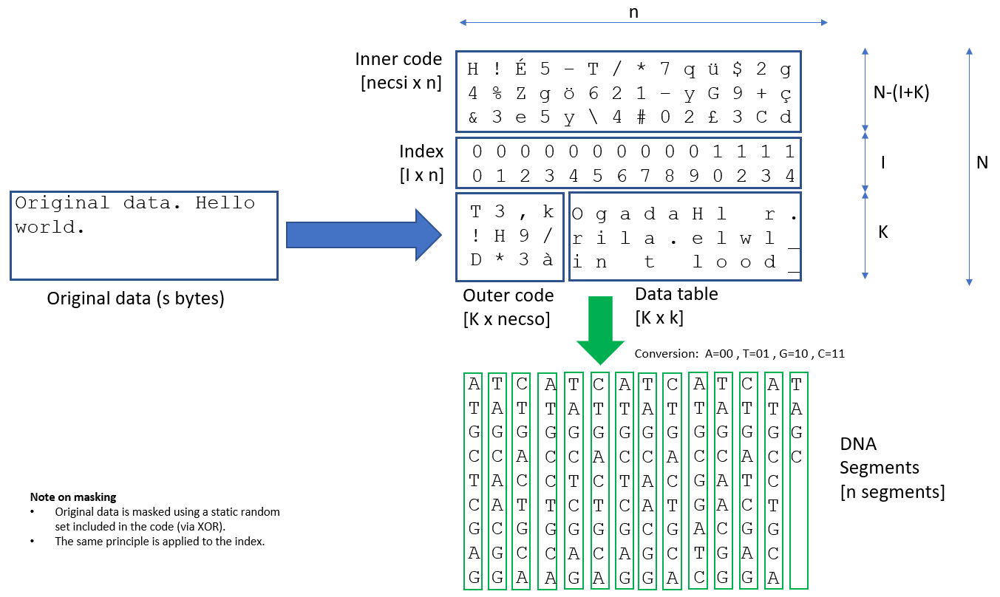

# archive2dna

**Author:** Jan Krause-Bilvin. 
**First release:** 2022-02-02.
**License:** [GPLv3](LICENSE)

Encodes a binary information package into DNA and decodes DNA
back into the original binary representation. Reed Solomon Error 
correcting codes ensure full data retrieval in case of DNA medium
partial damage.

Warning: tool in early development stage, do not use in production.

# Description

This software enables long term preservation of information in
DNA, typically for centuries at room temperature (depending
on the DNA conditioning). 

Default parameters cover a wide range of information package sizes. 
When using default parameters no information is required to decode an 
information package from its DNA representation.

Reed Solomon error correcting is applied along two dimensions 
with the aim to maximize the chances of a successful data retrieval 
even in case of DNA storage damaged or partial loss.

The tool is fully compatible with ISO 14721 (OAIS). 

Archival information packages (AIP) identification is implemented 
into the DNA representation of packages, allowing the directed 
access to any specific AIP via its persistent identifier (PID): 
Each PID is mapped using a deterministic algorithm to a DNA primer 
that may be used to amplify the package via polymerase chain 
reaction (PCR).

Additionally, knowing the PID is not required to decode an 
information package: archived packages in the same physical 
container may be read as a whole and the individual the packages 
restored on an individual basis.

Written in pure Python and without external libraries this tool 
is multi-platform.

# Usage

## Quickstart using the command line interface (CLI)

Encode an information package (here aip_olos.zip) into DNA
(here dna.txt) using the "olos:123" identifier to generate primer 
identification of DNA representation.

```
python cli.py encode tests/data/aip_olos.zip  dna.txt "olos:123"
```

Decode back (identifier may be unknown):

```
python cli.py decode dna.txt aip_decoded.zip "unknown"
```

## Application programming interface (API)

Rue the demo API:

```
python api.py
```

Encoding (POST the 'aip.zip' package file and the PID):

```
curl -F id="olos:123" -F data="@aip.zip" -X POST http://localhost:8080/encode
```

Decoding (POST the 'dna.txt' DNA segments file): 

```
curl --data-binary @dna.txt -X POST http://localhost:8080/decode -o aip_decoded.zip
```
## Library

Direct usage in pythonic applications.

## Encoding binaray package to DNA

``` python
from archive2dna import package
c = package.Container( 'olos:1234' )
binary_data = open( 'package.zip', 'rb' ).read()
c.load_binary( binary_data ) 
c.create_logical_redundancy()
c.convert_to_dna()
text = c.write_dna()
open( 'dna.txt', 'w' ).write( text )
c.compute_segments_sizes()
print( c.compute_stats() )
```

## Decoding DNA to binary package

``` python
c = package.Container()
text = open('dna.txt', 'r').read()
c.load_dna(text)
c.check_and_correct_logical_redundancy()
binary_data = c.write_binary()
open(binary, 'wb').write(binary_data)
print(c.compute_stats())
```

# Method description

## Reed Solomon error correcting algorithm

> Reed–Solomon codes operate on a block of data treated as a set of
> finite-field elements called symbols. Reed–Solomon codes are able to
> detect and correct multiple symbol errors. By adding t = n − k check
> symbols to the data, a Reed–Solomon code can detect (but not correct)
> any combination of up to t erroneous symbols, or locate and correct up
> to t/2 erroneous symbols at unknown locations. As an erasure code, it
> can correct up to t erasures at locations that are known and provided
> to the algorithm, or it can detect and correct combinations of errors
> and erasures. Reed–Solomon codes are also suitable as multiple-burst
> bit-error correcting codes, since a sequence of b + 1 consecutive bit
> errors can affect at most two symbols of size b. The choice of t is up
> to the designer of the code and may be selected within wide limits.

Source: [Wikipedia - Reed Solomon error correcting](https://en.wikipedia.org/wiki/Reed%E2%80%93Solomon_error_correction)

The folloing Reed Solomon library was included in this tool:
[https://github.com/tomerfiliba/reedsolomon](https://github.com/tomerfiliba/reedsolomon)). It

It was chosen because:
* it is an universal Reed Solomon library, 
* that is extensively documented on
[wikiversitiy](https://en.wikiversity.org/wiki/Reed%E2%80%93Solomon_codes_for_coders), 
* and written in pure Python (no external dependency required). 

## DNA package representation

archive2dna is largely based on the research of the [ETHZ Functional Materials
Laboratory](https://fml.ethz.ch/). Implemented concepts are described
in the following publication:

> Meiser, Linda C., Philipp L. Antkowiak, Julian Koch, Weida D. Chen, 
> A. Xavier Kohll, Wendelin J. Stark, Reinhard Heckel, et Robert N. Grass. 
> "Reading and Writing Digital Data in DNA". Nature Protocols 15, 
> no 1 (January 2020): 86 101. https://doi.org/10.1038/s41596-019-0244-5.

A more detailed analysis of this DNA data storage approach was also published:

> Heckel, R., Mikutis, G. & Grass, R.N. "A Characterization of the DNA Data Storage Channel". 
> Sci Rep 9, 9663 (2019). https://doi.org/10.1038/s41598-019-45832-6  

Adaptations of theses concepts were made, and following DNA data representation is used:



The implementation choice was made to represent each element as bit
pairs, each pair corresponding to a DNA base. In the source code,
positional variables starting with the letter "d" refer to positions
of these bit pairs (e.g. mo -> dmo, k -> dk and son on).

## DNA to bits mapping

Correspondence table between bit pairs and DNA bases:

``` python
bits2dna_dict = { '00' : 'A',
                  '01' : 'T',
                  '10' : 'G',
                  '11' : 'C' }
```

### Index

The index is composed of two parts. The upper part contains a
numeration of the fragments starting at 0. The lower part consists
of partial countdowns to the end of outer code error correcting
symbols and end of messages (the actual data to preserve). These 
countdowns enable auto detection of the mentioned parameters even if
many DNA segments are no longer readable.

### Masking using random data 

Both the binary data of the package and the index are masked using
random data applied using a XOR operation. The random data sets are
included in the source code as they are required to restore the data.

These oparations are necessary to avoid repetitive DNA sequences that are
problematic during synthesis and PCR operations.

### Identification and primers

Directed access to DNA encoded packages (i.e. sets of DNA segments
that constitute a package) is achieved using a specific primer in a [polymerase chain
reaction](https://en.wikipedia.org/wiki/Polymerase_chain_reaction).

archive2dna manges these primers: they are generated deterministically
on the basis of the package identifier. Any package identifier format is supported,
although each package must recieve a unique identifier.

The folloiwng function is generates the primer bits:

``` python
def id2primer(package_id, length=5):
    """Computes a primer on basis of id string (encoded in utf-8). 
    Primer length default of 5 bytes, i.e 5 x 4 = 20 nuclotides
       (allowing for over 1000 billion possibilities)."""
    primer_bytes = hashlib.sha256( bytes(package_id,encoding='utf-8') ).digest()[-length:]
    return bytes2dna(primer_bytes)
```

### Zipping

At the very begin of the encoding process, the information package is zipped by default. 
It is unzipped at the end of decoding. This feature may be turned off if the
package to archive is already a ZIP file or another conainter supporting
padding at the end (i.e. that empty bytes are added the end of the file).

This ensures that:
* a checksum of the package is taken before encoding and checked at decoding
* homogeneous sections of data are reduced by compression (they are problematic in DNA)
* informatio package size is reduced
* padding of last DNA segment when it is restored via outer code is removed (as ZIP ingnores trailing zeroes) 


## Parameters

### Inner code

* Symbols size : mi = 8 bits allows for support of DNA segment up to 1024
  nucleotides (2**8 blocks of 4 DNA bases)
* Reed Solomon N=34, K=30 : allow to correct up to 4 blocks of 4
  nucleotides, i.e. an inner redundancy over 10%.
* DNA segments of reasonable size (considering other default
  parameters they are of 136 nucleotides without primers),

### Outer code

* Symbols size : mo = 14 bits allows for support of outer code blocks of
  2^14 * 14/2 (over 10^5) nucleotides/fragments.
* n_max = 2**mo-1
* the number of fragments is chosen to fit the size of the binary package
  to be encoded
* k  auto computed on basis of package size so that outer
  redundancy is of quite exactly of 40% (as recommended).

### Index
* index_positions=24 bits : allow for 2^24 (over 10^7) segments par
  package i.e. a capacity of over 400 MB per package (using default
  K=30). Using higher values for K, e.g. K=900 would theoretically
  increase the package capacity over 10 GB (but this requires synthesis
  of longer DNA segments).
* index_length=32 bits : leave index_length - index_positions = 8 bits
  to prepare for auto-detection of the n,k parameters when decoding DNA.

### Random data 

The random data sets are included in the source code as they are 
required to restore the data.

### Identification and primers

Default primer lenght is of 5 bytes, i.e. 20 nucleotides. This is enough
to identifiy millions of information packages and appropriated for PCR.


# Requirements

Python >=3.6.

# Test suite

To run full test suite:

```
python -m unittest tests/test*.py
```

# Issues

[Issues and todo](issues/issues.md)


# License

This software was written by Jan Kraue-Bilvin (first release and is licensed under the GNU GPLv3 license : 
[https://www.gnu.org/licenses/gpl-3.0.html](https://www.gnu.org/licenses/gpl-3.0.html)

With the exeption of the icluded file archive2dna/reedsolo.py (taken
from the repository
[https://github.com/tomerfiliba/reedsolomon](https://github.com/tomerfiliba/reedsolomon)).
This python module was conceived by Torner Filiba, maintained by Stephen Karl
Larroque and others and it is placed under MIT License.
